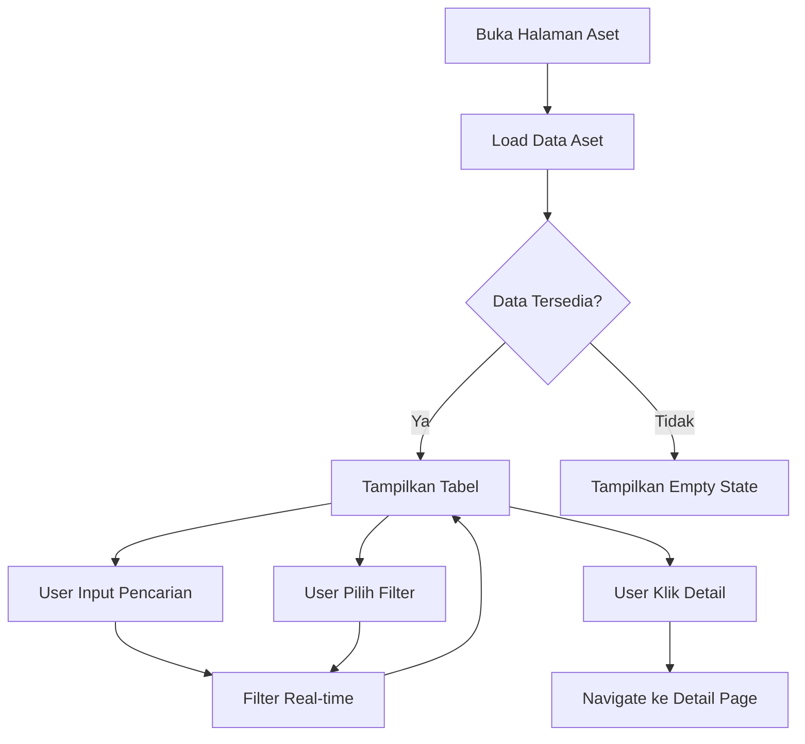
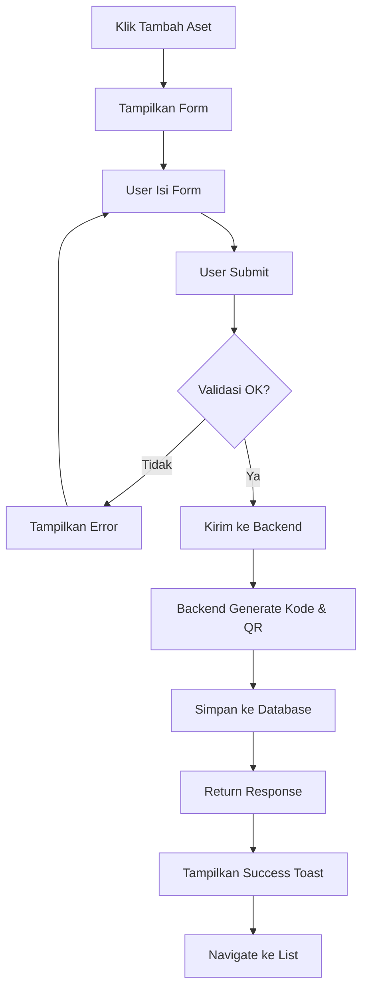
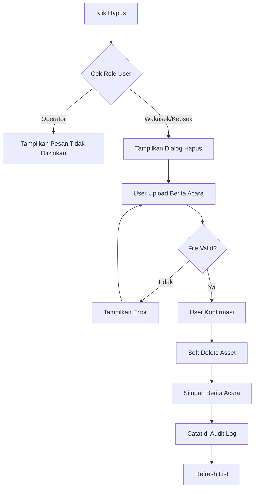

# Design Document - Halaman Aset (Asset Management)

## Overview

Dokumen ini menjelaskan desain teknis untuk halaman manajemen aset pada aplikasi SIMANIS. Fitur ini memungkinkan pengelolaan data aset sekolah secara lengkap dengan auto-generate kode aset dan QR code.

### Tujuan
- Menyediakan antarmuka untuk CRUD aset sekolah
- Auto-generate kode aset dengan format standar
- Generate QR code untuk pelabelan aset
- Mendukung filter, pencarian, dan pagination
- Implementasi soft delete dengan upload Berita Acara

### Tech Stack
- **Frontend**: React 19 + TypeScript + Vite
- **State Management**: Zustand + TanStack Query
- **Forms**: React Hook Form + Zod
- **UI**: Tailwind CSS + Custom Components
- **Backend**: Fastify + Prisma ORM
- **Database**: MySQL 8.0
- **QR Code**: qrcode library (backend)

## Architecture

```
┌─────────────────────────────────────────────────────────────┐
│                      Frontend (React)                        │
├─────────────────────────────────────────────────────────────┤
│  Pages                    │  Components                      │
│  ├── AssetsListPage       │  ├── DataTable                   │
│  ├── AssetCreatePage      │  ├── FilterBar                   │
│  ├── AssetEditPage        │  ├── FileUpload                  │
│  ├── AssetDetailPage      │  ├── QRCodeDisplay               │
│  └── QRCodePrintPage      │  └── DeleteAssetDialog           │
├─────────────────────────────────────────────────────────────┤
│  API Layer (libs/api/)    │  Validation (libs/validation/)   │
│  └── assets.ts            │  └── assetSchemas.ts             │
└─────────────────────────────────────────────────────────────┘
                              │
                              ▼
┌─────────────────────────────────────────────────────────────┐
│                    Backend (Fastify)                         │
├─────────────────────────────────────────────────────────────┤
│  Controllers              │  Use Cases                       │
│  └── AssetController      │  ├── CreateAssetUseCase          │
│                           │  ├── UpdateAssetUseCase          │
│                           │  ├── DeleteAssetUseCase          │
│                           │  └── GenerateQRCodeUseCase       │
├─────────────────────────────────────────────────────────────┤
│  Repositories             │  Services                        │
│  └── AssetRepository      │  ├── QRCodeService               │
│                           │  └── AssetCodeGenerator          │
└─────────────────────────────────────────────────────────────┘
                              │
                              ▼
┌─────────────────────────────────────────────────────────────┐
│                    Database (MySQL)                          │
├─────────────────────────────────────────────────────────────┤
│  assets                   │  asset_categories                │
│  asset_mutations          │  asset_deletions                 │
│  rooms → floors → buildings                                  │
└─────────────────────────────────────────────────────────────┘
```

## Components and Interfaces

### Frontend Components

#### 1. AssetsListPage
Halaman utama daftar aset dengan fitur:
- Tabel dengan kolom: Kode Aset, Nama Barang, Kategori, Lokasi, Kondisi, Nilai
- Pencarian real-time (kode aset / nama barang)
- Filter: Kategori, Kondisi
- Pagination: 10, 25, 50 item per halaman
- Bulk actions untuk user dengan permission

#### 2. AssetCreatePage
Form tambah aset baru:
- Field wajib: Nama Barang, Kategori, Kondisi, Harga, Sumber Dana
- Field opsional: Merk, Spesifikasi, Tahun Perolehan, Lokasi, Foto
- Kode aset di-generate otomatis oleh backend
- Validasi client-side dengan Zod

#### 3. AssetEditPage
Form edit aset:
- Kode aset readonly (tidak bisa diubah)
- Semua field lain dapat diedit
- Perubahan dicatat di audit trail

#### 4. AssetDetailPage
Halaman detail aset:
- Informasi lengkap aset
- QR Code display dengan tombol download/cetak
- Riwayat mutasi lokasi
- Tombol edit/hapus (sesuai permission)

#### 5. DeleteAssetDialog
Dialog konfirmasi hapus:
- Upload Berita Acara (wajib)
- Hanya untuk role Wakasek Sarpras / Kepsek
- Soft delete (is_deleted = true)

### API Interfaces

```typescript
// GET /api/assets
interface GetAssetsParams {
  search?: string
  categoryId?: number
  kondisi?: AssetCondition
  page?: number
  pageSize?: number // 10 | 25 | 50
}

// POST /api/assets
interface CreateAssetRequest {
  namaBarang: string
  merk?: string
  spesifikasi?: string
  categoryId: number
  kondisi: AssetCondition
  harga: number
  sumberDana: SumberDana
  tahunPerolehan?: string
  currentRoomId?: number
  masaManfaatTahun?: number
}

// Response includes auto-generated fields
interface CreateAssetResponse {
  id: number
  kodeAset: string  // Auto-generated: SCH/KD/KAT/NOURUT
  qrCode: string    // Auto-generated QR code data
  // ... other fields
}

// DELETE /api/assets/:id
interface DeleteAssetRequest {
  beritaAcaraFile: File  // Required
}
```

## Data Models

### Asset Entity (sesuai database)

```typescript
interface Asset {
  id: number
  kodeAset: string           // Format: SCH/KD/KAT/NOURUT
  namaBarang: string
  merk: string | null
  spesifikasi: string | null
  tahunPerolehan: Date | null
  harga: Decimal
  sumberDana: 'BOS' | 'APBD' | 'Hibah'
  kondisi: 'Baik' | 'Rusak Ringan' | 'Rusak Berat' | 'Hilang'
  fotoUrl: string | null
  qrCode: string             // QR code data/URL
  tanggalPencatatan: DateTime
  createdBy: number | null
  categoryId: number | null
  masaManfaatTahun: number
  isDeleted: boolean
  deletedAt: DateTime | null
  currentRoomId: number | null
  
  // Relations
  category?: AssetCategory
  currentRoom?: Room
  creator?: User
}
```

### Kode Aset Format

```
SCH/KD/KAT/NOURUT
│   │  │   │
│   │  │   └── Nomor urut 3 digit (001, 002, ...)
│   │  └────── Kode kategori 3 huruf (ELK, FRN, BKU, ...)
│   └───────── Kode sekolah 2 huruf
└───────────── Prefix tetap "SCH"

Contoh:
- SCH/01/ELK/001 = Elektronik pertama
- SCH/01/FRN/015 = Furniture ke-15
```

### Kategori Mapping

| Kategori | Kode |
|----------|------|
| Elektronik | ELK |
| Furniture | FRN |
| Buku | BKU |
| Alat Olahraga | OLR |
| Kendaraan | KDR |
| Alat Lab | LAB |
| Lainnya | LNY |


## Correctness Properties

*A property is a characteristic or behavior that should hold true across all valid executions of a system-essentially, a formal statement about what the system should do. Properties serve as the bridge between human-readable specifications and machine-verifiable correctness guarantees.*

### Property 1: Search Filter Correctness
*For any* search term entered by the user, all assets displayed in the results must contain that search term in either the `kodeAset` or `namaBarang` field (case-insensitive).
**Validates: Requirements 1.2**

### Property 2: Category Filter Correctness
*For any* category filter selection, all assets displayed must have a `categoryId` matching the selected category.
**Validates: Requirements 1.3**

### Property 3: Condition Filter Correctness
*For any* condition filter selection, all assets displayed must have a `kondisi` value matching the selected condition.
**Validates: Requirements 1.4**

### Property 4: Pagination Item Count
*For any* page size selection (10, 25, or 50), the number of items displayed per page must not exceed the selected page size.
**Validates: Requirements 1.5**

### Property 5: Asset Code Format Validation
*For any* newly created asset, the generated `kodeAset` must match the format `SCH/XX/YYY/NNN` where XX is school code, YYY is category code, and NNN is a 3-digit sequential number.
**Validates: Requirements 2.2**

### Property 6: QR Code Round Trip
*For any* asset with a generated QR code, decoding the QR code must return the exact `kodeAset` of that asset.
**Validates: Requirements 2.3**

### Property 7: Required Field Validation
*For any* form submission with empty required fields (namaBarang, categoryId, kondisi, harga, sumberDana), the system must reject the submission and display validation errors.
**Validates: Requirements 2.4**

### Property 8: Photo Upload Validation
*For any* file uploaded as asset photo, the system must accept only JPG/PNG formats with size ≤ 2MB, and reject all other files.
**Validates: Requirements 2.5**

### Property 9: Audit Trail on Update
*For any* asset update operation, there must be a corresponding entry in the audit_logs table recording the change.
**Validates: Requirements 3.2**

### Property 10: Condition Enum Validation
*For any* kondisi value submitted, it must be one of: 'Baik', 'Rusak Ringan', 'Rusak Berat', 'Hilang'.
**Validates: Requirements 3.3**

### Property 11: Asset Code Immutability
*For any* existing asset, the `kodeAset` field must not be modifiable through the update API.
**Validates: Requirements 3.4**

### Property 12: Soft Delete with Berita Acara
*For any* asset deletion, the operation must only succeed if a Berita Acara document is provided, and the asset must be soft-deleted (is_deleted = true) rather than hard-deleted.
**Validates: Requirements 5.2, 5.4**

## Error Handling

### Frontend Error Handling

```typescript
// API Error Response Format
interface ApiError {
  statusCode: number
  message: string
  errors?: Record<string, string[]>  // Field-level validation errors
}

// Error handling in components
try {
  await createAsset(data)
  showSuccessToast('Aset berhasil ditambahkan')
  navigate('/assets')
} catch (error) {
  if (error.statusCode === 400) {
    // Validation error - show field errors
    setFieldErrors(error.errors)
  } else if (error.statusCode === 403) {
    // Permission denied
    showErrorToast('Anda tidak memiliki akses untuk aksi ini')
  } else {
    // Generic error
    showErrorToast('Terjadi kesalahan. Silakan coba lagi.')
  }
}
```

### Backend Error Handling

```typescript
// Custom error classes
class ValidationError extends AppError {
  constructor(message: string, errors: Record<string, string[]>) {
    super(message, 400)
    this.errors = errors
  }
}

class ForbiddenError extends AppError {
  constructor(message: string = 'Akses ditolak') {
    super(message, 403)
  }
}

// Asset-specific errors
class AssetNotFoundError extends AppError {
  constructor(id: number) {
    super(`Aset dengan ID ${id} tidak ditemukan`, 404)
  }
}

class BeritaAcaraRequiredError extends AppError {
  constructor() {
    super('Berita Acara wajib diupload untuk menghapus aset', 400)
  }
}
```

## Testing Strategy

### Unit Testing (Vitest)

Unit tests akan mencakup:
- Validasi schema Zod untuk form input
- Utility functions (formatCurrency, generateAssetCode)
- Component rendering dengan data mock

```typescript
// Contoh unit test untuk validasi
describe('createAssetSchema', () => {
  it('should reject empty namaBarang', () => {
    const result = createAssetSchema.safeParse({ namaBarang: '' })
    expect(result.success).toBe(false)
  })
  
  it('should accept valid asset data', () => {
    const result = createAssetSchema.safeParse({
      namaBarang: 'Laptop Lenovo',
      categoryId: 1,
      kondisi: 'Baik',
      harga: 5000000,
      sumberDana: 'BOS'
    })
    expect(result.success).toBe(true)
  })
})
```

### Property-Based Testing (fast-check)

Property tests akan memvalidasi correctness properties menggunakan fast-check library.

```typescript
import fc from 'fast-check'

// Property 1: Search filter correctness
describe('Asset Search Filter', () => {
  it('**Feature: asset-management, Property 1: Search Filter Correctness**', () => {
    fc.assert(
      fc.property(
        fc.array(assetArbitrary),
        fc.string(),
        (assets, searchTerm) => {
          const filtered = filterAssetsBySearch(assets, searchTerm)
          return filtered.every(asset => 
            asset.kodeAset.toLowerCase().includes(searchTerm.toLowerCase()) ||
            asset.namaBarang.toLowerCase().includes(searchTerm.toLowerCase())
          )
        }
      ),
      { numRuns: 100 }
    )
  })
})

// Property 6: QR Code round trip
describe('QR Code Generation', () => {
  it('**Feature: asset-management, Property 6: QR Code Round Trip**', () => {
    fc.assert(
      fc.property(
        assetCodeArbitrary,
        async (kodeAset) => {
          const qrData = await generateQRCode(kodeAset)
          const decoded = await decodeQRCode(qrData)
          return decoded === kodeAset
        }
      ),
      { numRuns: 100 }
    )
  })
})
```

### Test Configuration

```typescript
// vitest.config.ts
export default defineConfig({
  test: {
    environment: 'jsdom',
    globals: true,
    setupFiles: ['./src/test/setup.ts'],
    coverage: {
      provider: 'v8',
      reporter: ['text', 'html'],
    },
  },
})
```

## Responsive & Flexible Design

### Breakpoints (Tailwind CSS)

| Breakpoint | Min Width | Target Device |
|------------|-----------|---------------|
| `sm` | 640px | Tablet portrait |
| `md` | 768px | Tablet landscape |
| `lg` | 1024px | Desktop |
| `xl` | 1280px | Large desktop |

### Responsive Layout Strategy

#### 1. AssetsListPage - Responsive Table

```
Desktop (lg+):
┌─────────────────────────────────────────────────────────────┐
│ [Search...] [Kategori ▼] [Kondisi ▼]        [+ Tambah Aset] │
├─────────────────────────────────────────────────────────────┤
│ ☆ │ Kode Aset │ Nama Barang │ Kategori │ Lokasi │ Kondisi │ Nilai │ Aksi │
├───┼───────────┼─────────────┼──────────┼────────┼─────────┼───────┼──────┤
│   │ SCH/01/.. │ Laptop...   │ Elektro..│ Lab 1  │ Baik    │ Rp 5jt│ 👁   │
└─────────────────────────────────────────────────────────────┘

Mobile (< md):
┌─────────────────────────┐
│ [Search...]             │
│ [Kategori ▼][Kondisi ▼] │
├─────────────────────────┤
│ ┌─────────────────────┐ │
│ │ SCH/01/ELK/001      │ │
│ │ Laptop Lenovo       │ │
│ │ Elektronik • Lab 1  │ │
│ │ ● Baik   Rp 5.000.000│ │
│ │ [Detail] [☆]        │ │
│ └─────────────────────┘ │
│ ┌─────────────────────┐ │
│ │ ...                 │ │
│ └─────────────────────┘ │
└─────────────────────────┘
```

#### 2. AssetCreatePage - Responsive Form

```typescript
// Grid layout responsive
<div className="grid grid-cols-1 md:grid-cols-2 gap-4 md:gap-6">
  {/* Field akan stack di mobile, 2 kolom di tablet+ */}
</div>
```

```
Desktop (md+):
┌─────────────────────────────────────────┐
│ Informasi Utama                         │
├───────────────────┬─────────────────────┤
│ Nama Barang *     │ Kategori *          │
│ [____________]    │ [Pilih ▼]           │
├───────────────────┼─────────────────────┤
│ Merk              │ Kondisi *           │
│ [____________]    │ [Pilih ▼]           │
└───────────────────┴─────────────────────┘

Mobile (< md):
┌─────────────────────────┐
│ Informasi Utama         │
├─────────────────────────┤
│ Nama Barang *           │
│ [__________________]    │
├─────────────────────────┤
│ Kategori *              │
│ [Pilih ▼]               │
├─────────────────────────┤
│ Merk                    │
│ [__________________]    │
└─────────────────────────┘
```

#### 3. AssetDetailPage - Responsive Layout

```
Desktop (lg+):
┌─────────────────────────────────────────────────────────────┐
│ ← Laptop Lenovo ThinkPad                    [Edit] [Hapus]  │
├─────────────────────────────────┬───────────────────────────┤
│ ┌─────────────────────────────┐ │ ┌───────────────────────┐ │
│ │        [Foto Aset]          │ │ │   Lokasi Saat Ini     │ │
│ │                             │ │ │   Lab Komputer 1      │ │
│ └─────────────────────────────┘ │ └───────────────────────┘ │
│ ┌─────────────────────────────┐ │ ┌───────────────────────┐ │
│ │ Informasi Aset              │ │ │   QR Code             │ │
│ │ Kategori: Elektronik        │ │ │   [QR Image]          │ │
│ │ Kondisi: ● Baik             │ │ │   [Download] [Cetak]  │ │
│ │ Merk: Lenovo                │ │ └───────────────────────┘ │
│ └─────────────────────────────┘ │                           │
└─────────────────────────────────┴───────────────────────────┘

Mobile (< lg):
┌─────────────────────────┐
│ ← Laptop Lenovo         │
│   [Edit] [Hapus]        │
├─────────────────────────┤
│ ┌─────────────────────┐ │
│ │    [Foto Aset]      │ │
│ └─────────────────────┘ │
│ ┌─────────────────────┐ │
│ │ Informasi Aset      │ │
│ │ Kategori: Elektronik│ │
│ │ Kondisi: ● Baik     │ │
│ └─────────────────────┘ │
│ ┌─────────────────────┐ │
│ │ Lokasi: Lab Komp 1  │ │
│ └─────────────────────┘ │
│ ┌─────────────────────┐ │
│ │ QR Code             │ │
│ │ [QR] [Download]     │ │
│ └─────────────────────┘ │
└─────────────────────────┘
```

### Flexible Components

#### DataTable dengan Card View Mobile

```typescript
// DataTable akan switch ke card view di mobile
interface DataTableProps<T> {
  columns: Column<T>[]
  data: T[]
  mobileCardRenderer?: (item: T) => React.ReactNode
  // Jika mobileCardRenderer disediakan, tampilkan cards di mobile
}
```

#### Filter Bar Collapsible

```typescript
// FilterBar collapse di mobile dengan toggle button
<FilterBar 
  collapsible={true}  // Collapse di mobile
  defaultExpanded={false}
>
  {/* Filter controls */}
</FilterBar>
```

### Touch-Friendly Design

- Minimum touch target: 44x44px
- Adequate spacing between interactive elements
- Swipe gestures untuk navigasi (optional)
- Pull-to-refresh untuk list (optional)

### Print-Friendly QR Code

```css
/* print-qr.css */
@media print {
  .no-print { display: none !important; }
  .print-only { display: block !important; }
  
  .qr-print-container {
    width: 100%;
    page-break-inside: avoid;
  }
  
  .qr-code-image {
    width: 150px;
    height: 150px;
  }
}
```

## Requirements Traceability Matrix

| Requirement | Design Component | Property Test |
|-------------|------------------|---------------|
| 1.1 Tabel dengan kolom | AssetsListPage columns | - |
| 1.2 Pencarian real-time | FilterBar + search | Property 1 |
| 1.3 Filter kategori | FilterBar + categoryFilter | Property 2 |
| 1.4 Filter kondisi | FilterBar + conditionFilter | Property 3 |
| 1.5 Pagination | DataTable pagination | Property 4 |
| 2.1 Form tambah aset | AssetCreatePage | - |
| 2.2 Auto-generate kode | Backend AssetCodeGenerator | Property 5 |
| 2.3 Generate QR code | Backend QRCodeService | Property 6 |
| 2.4 Validasi field wajib | Zod schema validation | Property 7 |
| 2.5 Upload foto | FileUpload component | Property 8 |
| 3.1 Form edit terisi | AssetEditPage | - |
| 3.2 Audit trail | Backend AuditLogService | Property 9 |
| 3.3 Validasi kondisi | Zod enum validation | Property 10 |
| 3.4 Kode aset readonly | AssetEditPage disabled field | Property 11 |
| 4.1 Halaman detail | AssetDetailPage | - |
| 4.2 QR code display | QRCodeDisplay component | - |
| 4.3 Cetak QR | QRCodePrintPage | - |
| 4.4 Riwayat mutasi | AssetMutationHistory component | - |
| 5.1 Dialog hapus | DeleteAssetDialog | - |
| 5.2 Soft delete | Backend DeleteAssetUseCase | Property 12 |
| 5.3 Permission check | usePermission hook | - |
| 5.4 Berita Acara wajib | DeleteAssetDialog validation | Property 12 |

## UI/UX Flow Diagrams

### Asset List Flow


### Create Asset Flow


### Delete Asset Flow

