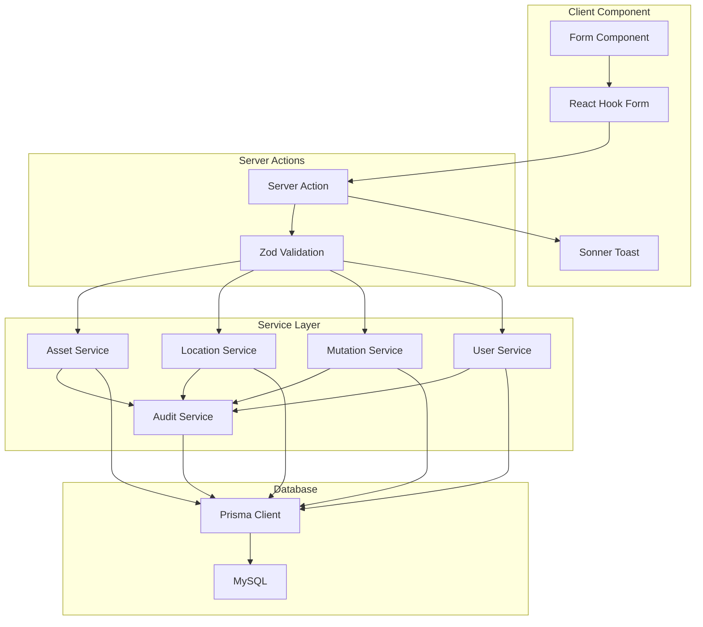

# Design Document: Form CRUD Implementation

## Overview

This design document outlines the implementation of CRUD functionality for all form components in SIMANIS. The current forms display correctly but lack data persistence. We will implement Next.js Server Actions integrated with the existing service layer and Zod validation schemas.

## Architecture



## Components and Interfaces

### Server Actions

Server actions will be created in `lib/actions/` directory following Next.js 16 conventions.

```typescript
// lib/actions/asset-actions.ts
"use server"

import { revalidatePath } from "next/cache"
import { assetService } from "@/lib/services/asset-service"
import { auditService } from "@/lib/services/audit-service"
import { createAssetSchema } from "@/lib/validations/asset"

export type ActionResult<T = void> = {
  success: boolean
  data?: T
  error?: string
}

export async function createAsset(formData: FormData): Promise<ActionResult<string>> {
  // 1. Parse and validate form data
  // 2. Generate unique ID (AST-XXXX)
  // 3. Call assetService.create()
  // 4. Call auditService.create() for logging
  // 5. Revalidate path
  // 6. Return result
}
```

### Form Component Updates

Forms will be updated to use React Hook Form with Zod resolver and call server actions.

```typescript
// Updated form component pattern
"use client"

import { useForm } from "react-hook-form"
import { zodResolver } from "@hookform/resolvers/zod"
import { useTransition } from "react"
import { toast } from "sonner"
import { createAsset } from "@/lib/actions/asset-actions"

export function AssetForm({ locations }: AssetFormProps) {
  const [isPending, startTransition] = useTransition()
  const form = useForm<CreateAssetInput>({
    resolver: zodResolver(createAssetSchema),
    defaultValues: { ... }
  })

  const onSubmit = (data: CreateAssetInput) => {
    startTransition(async () => {
      const result = await createAsset(data)
      if (result.success) {
        toast.success("Aset berhasil ditambahkan")
        setOpen(false)
        form.reset()
      } else {
        toast.error(result.error)
      }
    })
  }
}
```

### Service Layer Extensions

Extend existing services with create methods:

```typescript
// lib/services/asset-service.ts (extended)
export const assetService = {
  // ... existing methods

  create: async (data: CreateAssetInput): Promise<TAsset> => {
    const asset = await prisma.asset.create({
      data: {
        id: data.id,
        name: data.name,
        category: data.category,
        status: "aktif",
        location: data.location,
        purchaseDate: data.purchaseDate,
        purchasePrice: data.purchasePrice,
        condition: "baik",
        description: data.description,
      }
    })
    return assetSchema.parse(asset)
  },

  generateId: async (): Promise<string> => {
    const lastAsset = await prisma.asset.findFirst({
      orderBy: { id: "desc" },
      where: { id: { startsWith: "AST-" } }
    })
    const lastNum = lastAsset ? parseInt(lastAsset.id.split("-")[1]) : 0
    return `AST-${String(lastNum + 1).padStart(4, "0")}`
  }
}
```

## Data Models

### Input Schemas (for form validation)

```typescript
// lib/validations/asset.ts (extended)
export const createAssetSchema = z.object({
  name: z.string().min(1, "Nama aset wajib diisi"),
  category: z.string().min(1, "Kategori wajib dipilih"),
  location: z.string().min(1, "Lokasi wajib dipilih"),
  purchaseDate: z.string().min(1, "Tanggal pembelian wajib diisi"),
  purchasePrice: z.coerce.number().min(0, "Harga harus positif"),
  description: z.string().default(""),
})

export type CreateAssetInput = z.infer<typeof createAssetSchema>
```

```typescript
// lib/validations/location.ts (extended)
export const createLocationSchema = z.object({
  name: z.string().min(1, "Nama lokasi wajib diisi"),
  type: z.enum(["gedung", "lantai", "ruangan"], {
    required_error: "Tipe lokasi wajib dipilih"
  }),
  parentId: z.string().optional(),
})

export type CreateLocationInput = z.infer<typeof createLocationSchema>
```

```typescript
// lib/validations/mutation.ts (extended)
export const createMutationSchema = z.object({
  assetId: z.string().min(1, "Aset wajib dipilih"),
  fromLocation: z.string().min(1, "Lokasi asal wajib dipilih"),
  toLocation: z.string().min(1, "Lokasi tujuan wajib dipilih"),
  date: z.string().min(1, "Tanggal mutasi wajib diisi"),
  notes: z.string().default(""),
}).refine(data => data.fromLocation !== data.toLocation, {
  message: "Lokasi asal dan tujuan tidak boleh sama",
  path: ["toLocation"]
})

export type CreateMutationInput = z.infer<typeof createMutationSchema>
```

```typescript
// lib/validations/user.ts (extended)
export const createUserSchema = z.object({
  name: z.string().min(1, "Nama wajib diisi"),
  email: z.string().email("Format email tidak valid"),
  password: z.string().min(6, "Password minimal 6 karakter"),
  role: z.enum(["admin", "manager", "staff", "viewer"], {
    required_error: "Role wajib dipilih"
  }),
})

export type CreateUserInput = z.infer<typeof createUserSchema>
```

### Audit Log Input

```typescript
// lib/validations/audit.ts (extended)
export const createAuditLogSchema = z.object({
  user: z.string(),
  action: z.enum(["CREATE", "UPDATE", "DELETE"]),
  module: z.string(),
  details: z.string(),
})

export type CreateAuditLogInput = z.infer<typeof createAuditLogSchema>
```


## Correctness Properties

*A property is a characteristic or behavior that should hold true across all valid executions of a system—essentially, a formal statement about what the system should do. Properties serve as the bridge between human-readable specifications and machine-verifiable correctness guarantees.*

### Property 1: Create operation persists data correctly

*For any* valid input data for asset/location/mutation/user, calling the create service method should result in a database record that matches the input data when queried back.

**Validates: Requirements 1.1, 2.1, 3.1, 4.1**

### Property 2: ID generation follows pattern and is unique

*For any* number of entities created, all generated IDs should:
- Match the pattern (AST-XXXX, LOC-XXX, MUT-XXX, USR-XXX)
- Be unique across all entities of the same type

**Validates: Requirements 1.6, 2.6, 3.7, 4.7**

### Property 3: Audit log creation on CRUD operations

*For any* successful create operation on asset/location/mutation/user, there should exist a corresponding audit log entry with:
- Correct action type ("CREATE")
- Correct module name
- Timestamp within acceptable range
- Non-empty details

**Validates: Requirements 1.4, 2.4, 3.4, 4.4, 5.1, 5.4**

### Property 4: Validation rejects invalid input

*For any* input that violates validation rules (empty required fields, invalid email format, negative numbers), the validation schema should return an error and prevent database insertion.

**Validates: Requirements 1.5, 2.5, 3.5, 4.5, 6.1, 6.2, 6.3, 6.5**

### Property 5: Mutation location validation

*For any* mutation where fromLocation equals toLocation, the validation should reject with an appropriate error message.

**Validates: Requirements 3.6**

### Property 6: Default values are set correctly

*For any* newly created mutation, status should be "diproses". *For any* newly created user, status should be "aktif". *For any* newly created asset, status should be "aktif" and condition should be "baik".

**Validates: Requirements 3.8, 4.8**

## Error Handling

### Validation Errors

```typescript
// Zod validation errors are caught and formatted
try {
  const validated = createAssetSchema.parse(data)
} catch (error) {
  if (error instanceof z.ZodError) {
    return {
      success: false,
      error: error.errors.map(e => e.message).join(", ")
    }
  }
}
```

### Database Errors

```typescript
// Prisma errors are caught and user-friendly messages returned
try {
  await prisma.asset.create({ data })
} catch (error) {
  if (error instanceof Prisma.PrismaClientKnownRequestError) {
    if (error.code === "P2002") {
      return { success: false, error: "Data sudah ada (duplikat)" }
    }
  }
  return { success: false, error: "Gagal menyimpan data" }
}
```

### Network/Server Errors

```typescript
// Server action wrapper with error boundary
export async function createAsset(data: CreateAssetInput): Promise<ActionResult> {
  try {
    // ... implementation
  } catch (error) {
    console.error("Create asset error:", error)
    return { success: false, error: "Terjadi kesalahan server" }
  }
}
```

## Testing Strategy

### Dual Testing Approach

We will use both unit tests and property-based tests for comprehensive coverage:

- **Unit tests**: Verify specific examples, edge cases, and error conditions
- **Property tests**: Verify universal properties across all inputs using fast-check library

### Unit Tests (Vitest)

```typescript
// lib/services/asset-service.test.ts
describe("assetService.create", () => {
  it("should create asset with valid data", async () => {
    const input = {
      name: "Test Laptop",
      category: "Elektronik",
      location: "Ruang Guru",
      purchaseDate: "2024-01-01",
      purchasePrice: 5000000,
      description: "Test description"
    }
    const result = await assetService.create(input)
    expect(result.id).toMatch(/^AST-\d{4}$/)
    expect(result.name).toBe(input.name)
  })

  it("should reject invalid data", async () => {
    const input = { name: "", category: "", ... }
    await expect(assetService.create(input)).rejects.toThrow()
  })
})
```

### Property-Based Tests (fast-check)

```typescript
// lib/services/asset-service.test.ts
import fc from "fast-check"

describe("Property Tests", () => {
  // Feature: form-crud-implementation, Property 1: Create operation persists data correctly
  it("should persist any valid asset data", async () => {
    await fc.assert(
      fc.asyncProperty(
        fc.record({
          name: fc.string({ minLength: 1 }),
          category: fc.constantFrom("Elektronik", "Furnitur", "Perlengkapan"),
          location: fc.string({ minLength: 1 }),
          purchaseDate: fc.date().map(d => d.toISOString().split("T")[0]),
          purchasePrice: fc.nat(),
          description: fc.string()
        }),
        async (input) => {
          const created = await assetService.create(input)
          const fetched = await assetService.getById(created.id)
          expect(fetched?.name).toBe(input.name)
          expect(fetched?.category).toBe(input.category)
        }
      ),
      { numRuns: 100 }
    )
  })

  // Feature: form-crud-implementation, Property 2: ID generation follows pattern
  it("should generate unique IDs matching pattern", async () => {
    await fc.assert(
      fc.asyncProperty(
        fc.array(validAssetInputArb, { minLength: 5, maxLength: 10 }),
        async (inputs) => {
          const ids = new Set<string>()
          for (const input of inputs) {
            const created = await assetService.create(input)
            expect(created.id).toMatch(/^AST-\d{4}$/)
            expect(ids.has(created.id)).toBe(false)
            ids.add(created.id)
          }
        }
      ),
      { numRuns: 100 }
    )
  })
})
```

### Test Configuration

- Minimum 100 iterations per property test
- Use test database (separate from development)
- Clean up test data after each test run
- Tag format: **Feature: form-crud-implementation, Property {number}: {property_text}**
