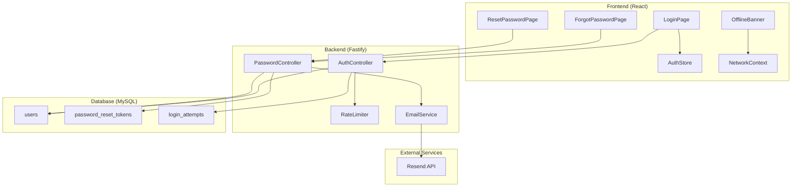

# Design Document: Login Enhancements

## Overview

Dokumen ini menjelaskan desain teknis untuk peningkatan fitur login pada aplikasi SIMANIS. Fitur-fitur yang akan diimplementasikan meliputi Remember Me, Offline Notice, Lupa Password, dan peningkatan error messages. Implementasi akan menggunakan stack teknologi yang sudah ada (React, Fastify, Prisma, MySQL) dengan penambahan Resend untuk email service.

## Architecture



## Components and Interfaces

### Frontend Components

#### 1. LoginPage Enhancement
```typescript
interface LoginFormValues {
  username: string
  password: string
  rememberMe: boolean  // NEW
}

interface AuthStore {
  user: User | null
  token: string | null
  isAuthenticated: boolean
  rememberMe: boolean  // NEW
  login: (user: User, token: string, rememberMe: boolean) => void
  logout: () => void
}
```

#### 2. OfflineBanner Component
```typescript
interface NetworkContextValue {
  isOnline: boolean
  wasOffline: boolean  // untuk menampilkan "Koneksi kembali"
}

// Component: src/components/layout/OfflineBanner.tsx
```

#### 3. ForgotPasswordPage
```typescript
interface ForgotPasswordFormValues {
  email: string
}

// Route: /forgot-password
```

#### 4. ResetPasswordPage
```typescript
interface ResetPasswordFormValues {
  password: string
  confirmPassword: string
}

// Route: /reset-password/:token
```

### Backend Endpoints

#### 1. Password Reset Endpoints
```typescript
// POST /api/auth/forgot-password
interface ForgotPasswordRequest {
  email: string
}
interface ForgotPasswordResponse {
  success: true
  message: string  // Selalu sama untuk mencegah enumerasi
}

// POST /api/auth/reset-password
interface ResetPasswordRequest {
  token: string
  password: string
}
interface ResetPasswordResponse {
  success: true
  message: string
}

// GET /api/auth/verify-reset-token/:token
interface VerifyResetTokenResponse {
  success: true
  valid: boolean
}
```

#### 2. Rate Limiting
```typescript
// Middleware untuk login attempts
interface LoginAttempt {
  ip: string
  username: string
  attemptedAt: Date
  success: boolean
}

// Config
const RATE_LIMIT_CONFIG = {
  login: {
    maxAttempts: 5,
    windowMinutes: 15
  },
  passwordReset: {
    maxAttempts: 3,
    windowMinutes: 60
  }
}
```

## Data Models

### New Database Tables

#### password_reset_tokens
```prisma
model PasswordResetToken {
  id        Int      @id @default(autoincrement())
  userId    Int      @map("user_id")
  token     String   @unique @db.VarChar(64)
  expiresAt DateTime @map("expires_at")
  usedAt    DateTime? @map("used_at")
  createdAt DateTime @default(now()) @map("created_at")
  
  user User @relation(fields: [userId], references: [id], onDelete: Cascade)
  
  @@index([token])
  @@index([userId])
  @@map("password_reset_tokens")
}
```

#### login_attempts
```prisma
model LoginAttempt {
  id          Int      @id @default(autoincrement())
  ip          String   @db.VarChar(45)
  username    String   @db.VarChar(64)
  success     Boolean
  attemptedAt DateTime @default(now()) @map("attempted_at")
  
  @@index([ip, attemptedAt])
  @@index([username, attemptedAt])
  @@map("login_attempts")
}
```

### Updated User Model
```prisma
model User {
  // ... existing fields
  email String? @unique @db.VarChar(190)  // Pastikan email unique untuk reset password
  
  passwordResetTokens PasswordResetToken[]
}
```

## Correctness Properties

*A property is a characteristic or behavior that should hold true across all valid executions of a system-essentially, a formal statement about what the system should do. Properties serve as the bridge between human-readable specifications and machine-verifiable correctness guarantees.*

### Property 1: Remember Me Storage Behavior
*For any* successful login with Remember Me enabled, the token SHALL be stored in localStorage; *for any* successful login without Remember Me, the token SHALL be stored in sessionStorage only.
**Validates: Requirements 1.1, 1.2**

### Property 2: Token Expiry Enforcement
*For any* token stored in localStorage, if the token age exceeds 30 days, the system SHALL clear the token and redirect to login page.
**Validates: Requirements 1.4**

### Property 3: Logout Clears All Storage
*For any* logout action, the system SHALL remove the token from both localStorage and sessionStorage, regardless of the original Remember Me setting.
**Validates: Requirements 1.5**

### Property 4: Offline Detection Consistency
*For any* change in network status (online to offline or vice versa), the system SHALL update the UI within 1 second to reflect the current status.
**Validates: Requirements 2.1, 2.2**

### Property 5: Password Reset Token Validity
*For any* password reset token, the token SHALL be valid for exactly 1 hour from creation and SHALL become invalid immediately after first use.
**Validates: Requirements 3.2, 3.6**

### Property 6: Password Reset Round Trip
*For any* valid password reset flow (request → email → reset), the user SHALL be able to login with the new password immediately after reset.
**Validates: Requirements 3.5**

### Property 7: Email Enumeration Prevention
*For any* forgot password request, the response message and timing SHALL be identical regardless of whether the email exists in the system.
**Validates: Requirements 3.3**

### Property 8: Consistent Login Error Messages
*For any* failed login attempt (invalid username OR invalid password), the error message SHALL be identical: "Username atau password salah".
**Validates: Requirements 4.1, 4.2**

### Property 9: Login Rate Limiting
*For any* IP address or username, after 5 failed login attempts within 15 minutes, subsequent login attempts SHALL be rejected until the window expires.
**Validates: Requirements 4.5**

### Property 10: Password Reset Rate Limiting
*For any* email address, after 3 password reset requests within 1 hour, subsequent requests SHALL be rejected until the window expires.
**Validates: Requirements 3.7**

## Error Handling

### Frontend Error Handling
```typescript
// Error message mapping
const ERROR_MESSAGES = {
  INVALID_CREDENTIALS: 'Username atau password salah',
  NETWORK_ERROR: 'Tidak dapat terhubung ke server. Periksa koneksi internet Anda.',
  SERVER_ERROR: 'Terjadi kesalahan pada server. Silakan coba lagi nanti.',
  RATE_LIMITED: 'Terlalu banyak percobaan. Silakan tunggu beberapa menit.',
  OFFLINE: 'Anda sedang offline. Fitur ini membutuhkan koneksi internet.',
  TOKEN_EXPIRED: 'Link reset password sudah kadaluarsa. Silakan request link baru.',
  TOKEN_USED: 'Link reset password sudah digunakan. Silakan request link baru.',
}
```

### Backend Error Codes
```typescript
enum AuthErrorCode {
  INVALID_CREDENTIALS = 'INVALID_CREDENTIALS',
  RATE_LIMITED = 'RATE_LIMITED',
  TOKEN_EXPIRED = 'TOKEN_EXPIRED',
  TOKEN_USED = 'TOKEN_USED',
  TOKEN_INVALID = 'TOKEN_INVALID',
}
```

## Testing Strategy

### Unit Testing
- Test individual components (OfflineBanner, LoginForm with Remember Me)
- Test AuthStore persistence logic
- Test password validation rules
- Test rate limiting logic

### Property-Based Testing
Library: **fast-check** (sudah terinstall di backend)

Property tests akan diimplementasikan untuk:
1. Token storage behavior (localStorage vs sessionStorage)
2. Token expiry validation
3. Rate limiting enforcement
4. Password reset token lifecycle
5. Error message consistency

Format tag untuk property tests:
```typescript
// **Feature: login-enhancements, Property 1: Remember Me Storage Behavior**
```

### Integration Testing
- End-to-end login flow with Remember Me
- Password reset email flow (mock Resend API)
- Offline/online transition handling
- Rate limiting across multiple requests

## Email Service Configuration

### Resend Setup
```typescript
// backend/src/infrastructure/email/resend.service.ts
import { Resend } from 'resend'

const resend = new Resend(process.env.RESEND_API_KEY)

interface SendPasswordResetEmailParams {
  to: string
  resetUrl: string
  userName: string
}

export const sendPasswordResetEmail = async (params: SendPasswordResetEmailParams) => {
  await resend.emails.send({
    from: 'SIMANIS <noreply@simanis.sch.id>',
    to: params.to,
    subject: 'Reset Password SIMANIS',
    html: `...` // Template HTML
  })
}
```

### Environment Variables
```env
# .env
RESEND_API_KEY=re_xxxxxxxxxxxxx
FRONTEND_URL=http://localhost:5000
PASSWORD_RESET_EXPIRY_HOURS=1
```
