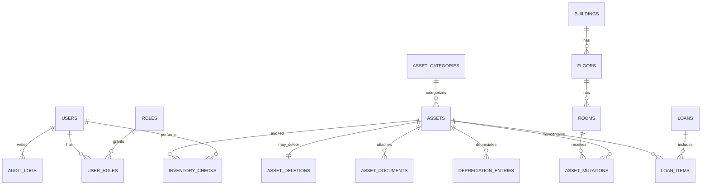

# Database Schema - SIMANIS

## Overview
Database menggunakan MySQL 8.0 dengan Prisma ORM. Schema didefinisikan di `backend/prisma/schema.prisma`.

## Daftar Tabel Utama

### Users & Auth
- `users` - Data pengguna sistem
- `roles` - Definisi role (admin, staff)
- `user_roles` - Relasi many-to-many users-roles
- `password_reset_tokens` - Token reset password
- `login_attempts` - Log percobaan login (rate limiting)

### Assets
- `assets` - Data aset utama
- `asset_categories` - Kategori aset
- `asset_mutations` - Riwayat perpindahan lokasi
- `asset_documents` - Dokumen terkait aset (BA, BAST)
- `asset_deletions` - Record penghapusan aset

### Location
- `buildings` - Gedung
- `floors` - Lantai
- `rooms` - Ruangan

### Transactions
- `loans` - Transaksi peminjaman
- `loan_items` - Item dalam peminjaman
- `inventory_checks` - Record inventarisasi/opname
- `depreciation_entries` - Entri penyusutan bulanan

### Audit
- `audit_logs` - Jejak perubahan data

## Entity Relationship Diagram



## Indeks yang Direkomendasikan
- `assets(kode_aset)` - UNIQUE, pencarian cepat
- `assets(qr_code)` - UNIQUE, scan QR
- `asset_mutations(asset_id, mutated_at DESC)` - Lokasi aktif
- `loans(status, tanggal_pinjam)` - Filter peminjaman
- `audit_logs(entity_type, entity_id)` - Penelusuran audit

## Migrasi
```bash
cd backend
npm run prisma:migrate      # Jalankan migrasi
npm run prisma:seed         # Seed data awal
npm run prisma:studio       # Buka Prisma Studio
```

## Backup
Untuk production, pastikan:
1. Backup database reguler (daily)
2. Point-in-time recovery enabled
3. Replica untuk high availability
