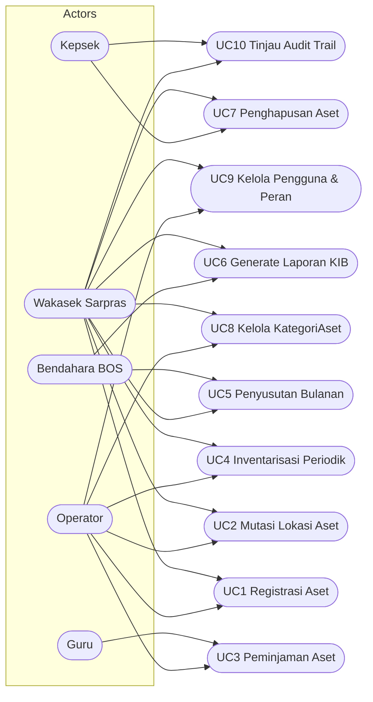

# Use Case & User Stories - SIMANIS

## Aktor Utama
- **Kepsek**: Menyetujui penghapusan aset, meninjau pelaporan KIB, memantau audit trail
- **Wakasek Sarpras**: Mengelola data aset, lokasi, kategori, mutasi, inventarisasi, laporan KIB
- **Bendahara BOS**: Memantau penyusutan dan implikasi nilai buku untuk pelaporan keuangan
- **Operator**: Melakukan input data aset, peminjaman, inventarisasi, generate QR code dan laporan KIB
- **Guru**: Mengajukan dan mengembalikan peminjaman aset

## Use Case Diagram

## Detail Use Case

### UC1 Registrasi Aset
- **Tujuan**: Mencatat aset baru dengan metadata lengkap dan menghasilkan QR code
- **Aktor**: Operator, Wakasek Sarpras
- **Alur**: Input data → Validasi → Generate QR → Simpan

### UC2 Mutasi Lokasi Aset
- **Tujuan**: Memindahkan aset antar lokasi dengan histori mutasi
- **Aktor**: Wakasek Sarpras, Operator
- **Alur**: Pilih aset → Pilih lokasi tujuan → Buat mutasi → Update lokasi aktif

### UC3 Peminjaman Aset
- **Tujuan**: Mengelola siklus peminjaman aset oleh Guru
- **Aktor**: Guru, Operator
- **Alur**: Ajukan → Serah terima → Pengembalian → Update status

### UC4 Inventarisasi Periodik
- **Tujuan**: Stock opname berkala menggunakan QR code dan foto
- **Aktor**: Operator, Wakasek Sarpras
- **Alur**: Scan QR → Upload foto → Simpan inventarisasi

### UC5 Penyusutan Bulanan
- **Tujuan**: Menghitung nilai penyusutan dan nilai buku aset
- **Aktor**: Sistem (otomatis), Bendahara BOS
- **Alur**: Scheduler akhir bulan → Hitung garis lurus → Simpan entri

### UC6 Generate Laporan KIB
- **Tujuan**: Menghasilkan laporan KIB dalam format Excel/PDF
- **Aktor**: Wakasek Sarpras, Bendahara BOS
- **Alur**: Pilih filter → Generate → Download

### UC7 Penghapusan Aset
- **Tujuan**: Mengubah status aset menjadi Dihapus dengan BA
- **Aktor**: Wakasek Sarpras, Kepsek
- **Alur**: Upload BA → Ubah status → Persetujuan Kepsek

### UC8 Kelola KategoriAset
- **Tujuan**: Menambah/edit daftar kategori aset
- **Aktor**: Operator, Wakasek Sarpras

### UC9 Kelola Pengguna & Peran
- **Tujuan**: Mengelola pengguna dan RBAC
- **Aktor**: Wakasek Sarpras, Operator

### UC10 Tinjau Audit Trail
- **Tujuan**: Meninjau perubahan data untuk akuntabilitas
- **Aktor**: Kepsek, Wakasek Sarpras

## User Stories

### Epic: Registrasi & Kategorisasi Aset
- **US-REG-1 [Must]**: Sebagai Operator, saya ingin mendaftarkan aset baru sehingga data inventaris lengkap

### Epic: Penempatan & Mutasi Lokasi
- **US-MUT-1 [Must]**: Sebagai Wakasek Sarpras, saya ingin memutasi aset sehingga lokasi terakhir selalu akurat

### Epic: Peminjaman
- **US-PJM-1 [Must]**: Sebagai Guru, saya ingin mengajukan peminjaman aset
- **US-PJM-2 [Should]**: Sebagai Operator, saya ingin menandai keterlambatan

### Epic: Inventarisasi
- **US-INV-1 [Must]**: Sebagai Operator, saya ingin stock opname via QR

### Epic: Penyusutan
- **US-PST-1 [Must]**: Sebagai Bendahara BOS, saya ingin melihat hasil penyusutan bulanan

### Epic: Pelaporan KIB
- **US-KIB-1 [Must]**: Sebagai Wakasek Sarpras, saya ingin menghasilkan laporan KIB

### Epic: Penghapusan Aset
- **US-HPS-1 [Must]**: Sebagai Wakasek Sarpras, saya ingin menghapus aset dengan BA

### Epic: Akses & Audit
- **US-RBAC-1 [Must]**: Sebagai Wakasek Sarpras, saya ingin mengatur peran pengguna
- **US-AUD-1 [Should]**: Sebagai Kepsek, saya ingin meninjau audit trail
