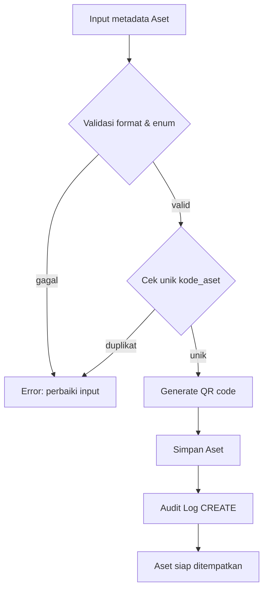
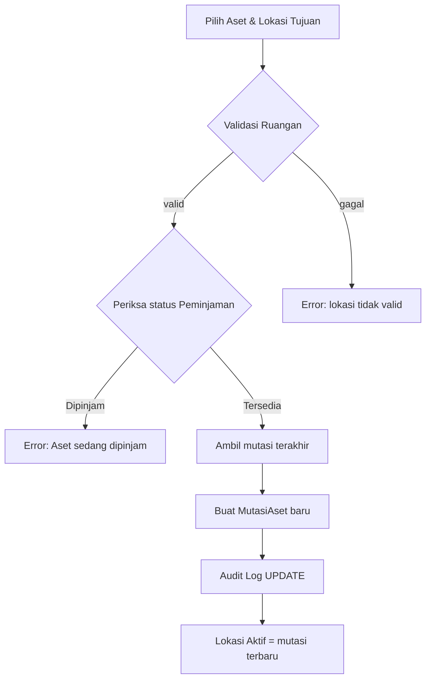

# Algoritma & Struktur Data – SIMANIS (Sistem Manajemen Aset Sekolah)

## Referensi Dokumen
- Model Domain: `model_domain.md` (mis. `model_domain.md:5–11`, `model_domain.md:31–60`, `model_domain.md:69–83`)
- Use Case & User Stories: `usecase_userstories.md` (mis. UC1 di `usecase_userstories.md:61–76`, UC2 `77–90`, UC3 `91–105`, UC4 `106–118`, UC5 `119–131`, UC6 `132–142`, UC7 `144–156`, UC9 `169–178`, UC10 `179–188`)
- Ubiquitous Language: `ubiquitous_language_dictionary.md` (istilah: Aset, KategoriAset, Lokasi, MutasiAset, Peminjaman, Inventarisasi, Penyusutan, Pengguna, QR code, Laporan KIB, BA)
- Skema Database: `database_schema.md` (tabel: `assets`, `asset_categories`, `buildings/floors/rooms`, `asset_mutations`, `loans`, `loan_items`, `inventory_checks`, `depreciation_entries`, `asset_documents`, `asset_deletions`, `users/roles/user_roles`, `audit_logs`)

---

## Struktur Data (Pemetaan ke Model Domain dan Skema Database)

```pseudocode
// Entity: Pengguna ↔ users
struct Pengguna {
  id: Integer
  name: String
  email: String
  username: String
  roles: List<Role> // join users ↔ user_roles ↔ roles
  created_at: DateTime
}

struct Role { id: Integer, name: String } // Kepsek, Wakasek Sarpras, Bendahara BOS, Operator, Guru (model_domain.md:28–29)

// Entity: KategoriAset ↔ asset_categories
struct KategoriAset { id: Integer, name: String, description: Text }

// Entity: Lokasi (Gedung → Lantai → Ruangan) ↔ buildings/floors/rooms
struct Gedung { id: Integer, name: String }
struct Lantai { id: Integer, building_id: Integer, level_number: Integer }
struct Ruangan { id: Integer, floor_id: Integer, name: String, code: String }

// Entity: Aset ↔ assets (model_domain.md:33–45)
struct Aset {
  id: Integer
  kode_aset: String // unik, SCH/KD/KAT/NOURUT (model_domain.md:34)
  nama_barang: String
  merk: String
  spesifikasi: Text
  tahun_perolehan: Date
  harga: Decimal
  sumber_dana: Enum{BOS, APBD, Hibah} (model_domain.md:40)
  kondisi: Enum{Baik, Rusak Ringan, Rusak Berat, Hilang} (model_domain.md:41)
  foto_url: Text
  qr_code: String // unik, generate otomatis (model_domain.md:43,72)
  tanggal_pencatatan: DateTime
  created_by: Integer // FK Pengguna
  category_id: Integer // FK KategoriAset
  masa_manfaat_tahun: Integer // (model_domain.md:59)
  is_deleted: Boolean
  deleted_at: DateTime
}

// Entity: MutasiAset ↔ asset_mutations (model_domain.md:63)
struct MutasiAset { id: Integer, asset_id: Integer, from_room_id: Integer?, to_room_id: Integer, mutated_at: DateTime, note: Text }

// Entity: Peminjaman ↔ loans (model_domain.md:47–53)
struct Peminjaman {
  id: Integer
  requested_by: Integer // Pengguna
  tanggal_pinjam: DateTime
  tanggal_kembali: DateTime?
  tujuan_pinjam: Text
  status: Enum{Dipinjam, Dikembalikan, Terlambat, Rusak} (model_domain.md:20–21,52)
  catatan: Text
}

// Entity: LoanItem ↔ loan_items
struct ItemPeminjaman { loan_id: Integer, asset_id: Integer, condition_before: String, condition_after: String }

// Entity: Inventarisasi ↔ inventory_checks (model_domain.md:22–24,64)
struct Inventarisasi { id: Integer, asset_id: Integer, checked_by: Integer, checked_at: DateTime, photo_url: Text, qr_code_scanned: String, note: Text }

// Entity: Penyusutan ↔ depreciation_entries (model_domain.md:56–59)
struct EntriPenyusutan { id: Integer, asset_id: Integer, tanggal_hitung: Date, nilai_penyusutan: Decimal, nilai_buku: Decimal, masa_manfaat_tahun_snapshot: Integer }

// Entity: Dokumen Aset (BA/BAST) ↔ asset_documents
struct DokumenAset { id: Integer, asset_id: Integer, doc_type: String, file_url: Text, uploaded_by: Integer, uploaded_at: DateTime }

// Entity: Penghapusan Aset ↔ asset_deletions (model_domain.md:75)
struct PenghapusanAset { id: Integer, asset_id: Integer, ba_document_id: Integer?, deleted_by: Integer, deleted_at: DateTime }

// Audit Trail ↔ audit_logs (model_domain.md:79–83)
struct AuditLog { id: Integer, entity_type: String, entity_id: Integer, user_id: Integer, action: Enum{CREATE, UPDATE, DELETE}, timestamp: DateTime, field_changed: JSON }
```

---

## Algoritma Bisnis Utama (Pseudocode + Kompleksitas)

### UC1 Registrasi Aset (US-REG-1 [Must])
Referensi: `usecase_userstories.md:61–76`, `model_domain.md:33–45`, `ubiquitous_language_dictionary.md:82–87`, `database_schema.md:62–80`.

```pseudocode
function registrasiAset(input: AsetDraft, actor: Pengguna): Aset
  // Validasi terminologi & wajib isi (kamus bahasa)
  assert input.kode_aset matches "SCH/KD/KAT/NOURUT" // model_domain.md:34
  assert input.sumber_dana in {BOS, APBD, Hibah} // model_domain.md:40
  assert input.kondisi in {Baik, Rusak Ringan, Rusak Berat, Hilang} // model_domain.md:41

  // Cek unik kode_aset
  if exists Aset where kode_aset = input.kode_aset then
    raise Error("kode_aset duplikat")

  // Generate QR code (deterministik atau UUID, disimpan unik)
  qr := generateQrCode(input.kode_aset)
  assert not exists Aset where qr_code = qr

  // Simpan record aset
  aset := insert into assets (
    kode_aset, nama_barang, merk, spesifikasi, tahun_perolehan,
    harga, sumber_dana, kondisi, foto_url, qr_code,
    tanggal_pencatatan, created_by, category_id, masa_manfaat_tahun
  ) values (..., now(), actor.id, input.category_id, input.masa_manfaat_tahun)

  // Catat audit trail
  insert into audit_logs (entity_type, entity_id, user_id, action, timestamp, field_changed)
    values ("Asset", aset.id, actor.id, CREATE, now(), json(input))

  return aset
```
Kompleksitas: waktu O(log N) untuk cek unik dengan indeks; ruang O(1) per aset.

### UC2 Mutasi Lokasi Aset (US-MUT-1 [Must])
Referensi: `usecase_userstories.md:77–90`, `model_domain.md:15–17,63`, `ubiquitous_language_dictionary.md:52–57`, `database_schema.md:81–89`.

```pseudocode
function mutasiAset(aset_id: Integer, to_room_id: Integer, actor: Pengguna, note: Text): MutasiAset
  // Validasi: lokasi tujuan ada dalam hierarki (Gedung→Lantai→Ruangan)
  assert exists Ruangan where id = to_room_id

  // Tidak boleh mutasi saat aset Dipinjam (alternatif UC3)
  if exists Peminjaman where status = Dipinjam and asset_id in LoanItems(aset_id) then
    raise Error("Aset sedang dipinjam")

  // Ambil lokasi aktif sebelumnya (mutasi terbaru)
  prev := select top 1 from asset_mutations where asset_id = aset_id order by mutated_at desc
  from_room_id := prev?.to_room_id

  // Buat mutasi baru
  m := insert into asset_mutations (asset_id, from_room_id, to_room_id, mutated_at, note)
       values (aset_id, from_room_id, to_room_id, now(), note)

  // Audit
  insert into audit_logs values ("Asset", aset_id, actor.id, UPDATE, now(), json({from_room_id, to_room_id}))

  return m

function lokasiAktif(aset_id: Integer): Ruangan
  // Ditentukan oleh mutasi terbaru (view asset_current_location)
  latest := select top 1 to_room_id from asset_mutations where asset_id = aset_id order by mutated_at desc
  return Ruangan(latest)
```
Kompleksitas: waktu O(log M) untuk mengambil mutasi terbaru dengan indeks; ruang O(1) per mutasi.

### UC3 Peminjaman Aset (US-PJM-1/2/3)
Referensi: `usecase_userstories.md:91–105`, `model_domain.md:47–53`, `ubiquitous_language_dictionary.md:58–63`, `database_schema.md:90–107`.

```pseudocode
function ajukanPeminjaman(requested_by: Pengguna, items: List<Integer>, tujuan: Text): Peminjaman
  // Validasi ketersediaan aset
  for asset_id in items:
    if exists Peminjaman where status = Dipinjam and asset_id in LoanItems(asset_id):
      raise Error("Aset tidak tersedia")

  loan := insert into loans (requested_by, tanggal_pinjam, tujuan_pinjam, status)
          values (requested_by.id, now(), tujuan, Dipinjam)

  for asset_id in items:
    insert into loan_items (loan_id, asset_id, condition_before) values (loan.id, asset_id, kondisiAset(asset_id))

  insert into audit_logs values ("Loan", loan.id, requested_by.id, CREATE, now(), json({items, tujuan}))
  return loan

function pengembalian(loan_id: Integer, actor: Pengguna, kondisi_akhir: Map<Integer,String>): void
  // Set tanggal kembali
  update loans set tanggal_kembali = now() where id = loan_id

  // Kelayakan status: Terlambat jika lewat SLA
  status := Dikembalikan
  if overdue(loan_id): status := Terlambat

  // Jika ada aset rusak
  if any kondisi_akhir[a] in {Rusak Ringan, Rusak Berat}:
    status := Rusak

  update loans set status = status where id = loan_id

  // Simpan kondisi akhir per item
  for (asset_id, cond) in kondisi_akhir:
    update loan_items set condition_after = cond where loan_id = loan_id and asset_id = asset_id
    if cond in {Rusak Ringan, Rusak Berat}:
      update assets set kondisi = cond where id = asset_id

  insert into audit_logs values ("Loan", loan_id, actor.id, UPDATE, now(), json({status}))
```
Kompleksitas: waktu O(K) per pengajuan/pengembalian dengan K jumlah aset; ruang O(K) untuk item.

### UC4 Inventarisasi Periodik (US-INV-1)
Referensi: `usecase_userstories.md:106–118`, `model_domain.md:22–24,64`, `ubiquitous_language_dictionary.md:64–69`, `database_schema.md:108–117`.

```pseudocode
function inventarisasiScan(qr: String, actor: Pengguna, photo_url: String?, note: Text?): Inventarisasi
  aset := select * from assets where qr_code = qr
  if not aset: raise Error("QR code tidak valid")

  inv := insert into inventory_checks (asset_id, checked_by, checked_at, photo_url, qr_code_scanned, note)
         values (aset.id, actor.id, now(), photo_url, qr, note)

  insert into audit_logs values ("InventoryCheck", inv.id, actor.id, CREATE, now(), json({asset_id: aset.id}))
  return inv
```
Kompleksitas: waktu O(log N); ruang O(1).

### UC5 Penyusutan Bulanan (Metode Garis Lurus) (US-PST-1)
Referensi: `usecase_userstories.md:119–131`, `model_domain.md:25–26,56–59,71`, `ubiquitous_language_dictionary.md:70–75,118–129`, `database_schema.md:118–127`.

```pseudocode
function schedulerPenyusutanBulanan(): void
  aset_eligible := select * from assets where masa_manfaat_tahun > 0 and is_deleted = FALSE
  for aset in aset_eligible:
    monthly := aset.harga / (aset.masa_manfaat_tahun * 12)
    last := select top 1 nilai_buku from depreciation_entries where asset_id = aset.id order by tanggal_hitung desc
    start_value := last ? last : aset.harga
    new_book := max(0, start_value - monthly)

    insert into depreciation_entries (asset_id, tanggal_hitung, nilai_penyusutan, nilai_buku, masa_manfaat_tahun_snapshot)
      values (aset.id, endOfMonth(today()), monthly, new_book, aset.masa_manfaat_tahun)

    insert into audit_logs values ("DepreciationEntry", aset.id, null, CREATE, now(), json({nilai_penyusutan: monthly, nilai_buku: new_book}))
```
Kompleksitas: waktu O(N) untuk N aset; ruang O(1) per aset.

### UC6 Generate Laporan KIB (US-KIB-1)
Referensi: `usecase_userstories.md:132–142`, `model_domain.md:73`, `ubiquitous_language_dictionary.md:88–93`, `database_schema.md` indeks & relasi.

```pseudocode
function generateKIB(filter: {kategori?, lokasi?, kondisi?}): File
  q := baseQueryKIB()
  if filter.kategori: q.where(category_id = filter.kategori)
  if filter.lokasi: q.where(asset_id in assetsAtLocation(filter.lokasi))
  if filter.kondisi: q.where(kondisi = filter.kondisi)
  data := execute(q)
  file := renderTo("Excel/PDF", data)
  return file
```
Kompleksitas: waktu O(R) untuk jumlah baris hasil; ruang O(R) untuk dataset.

### UC7 Penghapusan Aset dengan BA (US-HPS-1/2)
Referensi: `usecase_userstories.md:144–156,234–240`, `model_domain.md:41,75`, `ubiquitous_language_dictionary.md:94–99`, `database_schema.md:128–145`.

```pseudocode
function hapusAset(aset_id: Integer, ba_file_url: String, actor: Pengguna): void
  // Unggah BA sebagai DokumenAset
  ba := insert into asset_documents (asset_id, doc_type, file_url, uploaded_by, uploaded_at)
        values (aset_id, "BA_PENGHAPUSAN", ba_file_url, actor.id, now())

  // Tandai aset dihapus
  update assets set is_deleted = TRUE, deleted_at = now() where id = aset_id

  // Catat entri penghapusan
  insert into asset_deletions (asset_id, ba_document_id, deleted_by, deleted_at)
    values (aset_id, ba.id, actor.id, now())

  insert into audit_logs values ("Asset", aset_id, actor.id, UPDATE, now(), json({is_deleted: TRUE}))
```
Kompleksitas: waktu O(1); ruang O(1).

### UC9 RBAC – Kelola Pengguna & Peran (US-RBAC-1)
Referensi: `usecase_userstories.md:169–178`, `model_domain.md:28–29`, `ubiquitous_language_dictionary.md:76–81`, `database_schema.md:23–39`.

```pseudocode
function hasAccess(user: Pengguna, resource: String, action: String): Boolean
  roles := select roles.name from user_roles join roles on roles.id = user_roles.role_id where user_id = user.id
  // Pemetaan kebijakan per peran (contoh)
  policy := {
    "Operator": {"Asset": {"CREATE": true, "UPDATE": true}},
    "Wakasek Sarpras": {"Asset": {"CREATE": true, "UPDATE": true, "DELETE": true}},
    "Kepsek": {"AssetDeletion": {"APPROVE": true}},
    // dst sesuai kebutuhan
  }
  for r in roles:
    if policy[r][resource][action] == true: return true
  return false
```
Kompleksitas: waktu O(R) untuk jumlah peran user; ruang O(1).

### UC10 Tinjau Audit Trail (US-AUD-1)
Referensi: `usecase_userstories.md:179–188`, `model_domain.md:79–83`, `ubiquitous_language_dictionary.md:166–170`, `database_schema.md:146–155`.

```pseudocode
function filterAuditTrail(filter: {entity_type?, entity_id?, user_id?, time_range?}): List<AuditLog>
  q := select * from audit_logs
  if filter.entity_type: q.where(entity_type = filter.entity_type)
  if filter.entity_id: q.where(entity_id = filter.entity_id)
  if filter.user_id: q.where(user_id = filter.user_id)
  if filter.time_range: q.where(timestamp between filter.time_range.start and filter.time_range.end)
  q.orderBy(timestamp desc)
  return execute(q)
```
Kompleksitas: waktu O(log L) jika indeks digunakan; ruang O(S) untuk hasil.

---

## Diagram Alur (Mermaid)

### Flow UC1 Registrasi Aset


### Flow UC2 Mutasi Lokasi


### Flow UC5 Penyusutan Bulanan
```mermaid
flowchart TD
  P1[Scheduler Akhir Bulan] --> P2[Ambil Aset eligible]
  P2 --> P3[Hitung nilai penyusutan (garis lurus)]
  P3 --> P4[Ambil nilai_buku terakhir / harga awal]
  P4 --> P5[Hitung nilai_buku baru]
  P5 --> P6[Simpan EntriPenyusutan]
  P6 --> P7[Audit Log CREATE]
```

---

## Daftar Pemeriksaan Konsistensi
- Terminologi identik dengan kamus bahasa (`ubiquitous_language_dictionary.md`): Aset, KategoriAset, Lokasi, MutasiAset, Peminjaman, Inventarisasi, Penyusutan, QR code, BA, Audit Trail.
- Struktur data memetakan langsung ke tabel `database_schema.md` dan atribut `model_domain.md`.
- Setiap algoritma mengutip UC/US terkait dari `usecase_userstories.md`.
- Constraint bisnis tercermin: unik `kode_aset`/`qr_code`, mutasi tidak saat Dipinjam, penyusutan otomatis per bulan, penghapusan memerlukan BA.
- Integritas referensial dijaga oleh penggunaan FK eksplisit pada pseudocode.

---

## Catatan Kompleksitas Global
- Registrasi Aset: waktu O(log N), ruang O(1).
- Mutasi Lokasi: waktu O(log M), ruang O(1).
- Peminjaman/Pengembalian: waktu O(K), ruang O(K).
- Inventarisasi: waktu O(log N), ruang O(1).
- Penyusutan Bulanan: waktu O(N), ruang O(1) per aset.
- Generate KIB: waktu O(R), ruang O(R).
- RBAC hasAccess: waktu O(Roles), ruang O(1).
- Audit Trail filter: waktu O(log L), ruang O(S).