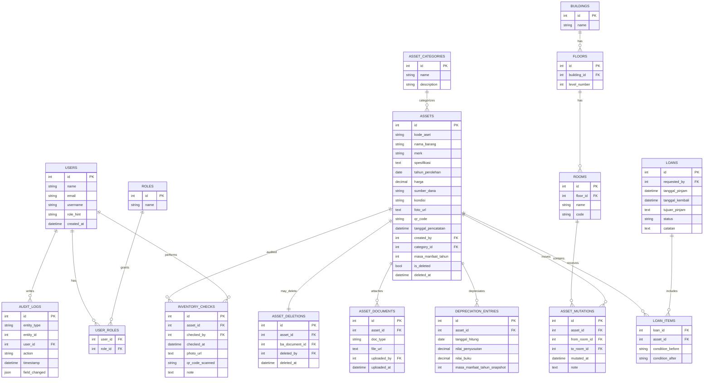

# Skema Database – SIMANIS (Sistem Manajemen Aset Sekolah)

## Tujuan & Prinsip
- Mengintegrasikan entitas dan relasi pada `model_domain.md` serta alur operasi pada `usecase_userstories.md` dengan terminologi konsisten dari `ubiquitous_language_dictionary.md`.
- Memastikan integritas referensial, normalisasi hingga minimal 3NF, dan dukungan terhadap business rules: QR code otomatis, mutasi memperbarui lokasi aktif, penyusutan bulanan, penghapusan aset dengan BA, audit trail.

## Daftar Tabel
- `users`, `roles`, `user_roles`
- `asset_categories`
- `buildings`, `floors`, `rooms`
- `assets`
- `asset_mutations`
- `loans`, `loan_items`
- `inventory_checks`
- `depreciation_entries`
- `asset_documents`
- `asset_deletions`
- `audit_logs`
- (opsional) View: `asset_current_location`

## Definisi Tabel & Kolom

### users
- `id` INTEGER PK AUTO
- `name` VARCHAR(120) NOT NULL
- `email` VARCHAR(190) UNIQUE
- `username` VARCHAR(64) UNIQUE
- `role_hint` VARCHAR(64)
- `created_at` TIMESTAMP NOT NULL DEFAULT CURRENT_TIMESTAMP

### roles
- `id` INTEGER PK AUTO
- `name` VARCHAR(64) UNIQUE NOT NULL  — nilai yang diakui: Kepsek, Wakasek Sarpras, Bendahara BOS, Operator, Guru (`model_domain.md:28–29`)

### user_roles
- `user_id` INTEGER FK → `users.id` ON DELETE CASCADE
- `role_id` INTEGER FK → `roles.id` ON DELETE CASCADE
- PK (`user_id`, `role_id`)

### asset_categories
- `id` INTEGER PK AUTO
- `name` VARCHAR(64) UNIQUE NOT NULL  — contoh: Elektronik, Furniture, Alat Lab (`model_domain.md:12–13`)
- `description` TEXT

### buildings
- `id` INTEGER PK AUTO
- `name` VARCHAR(80) UNIQUE NOT NULL

### floors
- `id` INTEGER PK AUTO
- `building_id` INTEGER FK → `buildings.id` ON DELETE CASCADE
- `level_number` INTEGER NOT NULL
- UNIQUE (`building_id`, `level_number`)

### rooms
- `id` INTEGER PK AUTO
- `floor_id` INTEGER FK → `floors.id` ON DELETE CASCADE
- `name` VARCHAR(80) NOT NULL
- `code` VARCHAR(32)
- UNIQUE (`floor_id`, `name`)

### assets
- `id` INTEGER PK AUTO
- `kode_aset` VARCHAR(50) UNIQUE NOT NULL  — format `SCH/KD/KAT/NOURUT` (`model_domain.md:34`)
- `nama_barang` VARCHAR(160) NOT NULL
- `merk` VARCHAR(120)
- `spesifikasi` TEXT
- `tahun_perolehan` DATE
- `harga` DECIMAL(18,2)
- `sumber_dana` VARCHAR(16) NOT NULL  — BOS/APBD/Hibah (`model_domain.md:40`)
- `kondisi` VARCHAR(20) NOT NULL  — Baik/Rusak Ringan/Rusak Berat/Hilang (`model_domain.md:41`)
- `foto_url` TEXT
- `qr_code` VARCHAR(128) UNIQUE NOT NULL (`model_domain.md:43,72`)
- `tanggal_pencatatan` TIMESTAMP NOT NULL DEFAULT CURRENT_TIMESTAMP (`model_domain.md:44`)
- `created_by` INTEGER FK → `users.id` ON DELETE SET NULL (`model_domain.md:45`)
- `category_id` INTEGER FK → `asset_categories.id` ON DELETE SET NULL (`model_domain.md:7`)
- `masa_manfaat_tahun` INTEGER NOT NULL CHECK (masa_manfaat_tahun >= 0) (`model_domain.md:59`)
- `is_deleted` BOOLEAN NOT NULL DEFAULT FALSE  — penghapusan administrasi (`model_domain.md:75`)
- `deleted_at` TIMESTAMP

### asset_mutations
- `id` INTEGER PK AUTO
- `asset_id` INTEGER FK → `assets.id` ON DELETE CASCADE
- `from_room_id` INTEGER FK → `rooms.id` ON DELETE SET NULL
- `to_room_id` INTEGER FK → `rooms.id` ON DELETE RESTRICT
- `mutated_at` TIMESTAMP NOT NULL DEFAULT CURRENT_TIMESTAMP
- `note` TEXT
- INDEX (`asset_id`, `mutated_at` DESC)

### loans
- `id` INTEGER PK AUTO
- `requested_by` INTEGER FK → `users.id` ON DELETE SET NULL
- `tanggal_pinjam` TIMESTAMP NOT NULL
- `tanggal_kembali` TIMESTAMP
- `tujuan_pinjam` TEXT
- `status` VARCHAR(16) NOT NULL  — Dipinjam/Dikembalikan/Terlambat/Rusak (`model_domain.md:20–21,52`)
- `catatan` TEXT
- INDEX (`status`, `tanggal_pinjam`)

### loan_items
- `loan_id` INTEGER FK → `loans.id` ON DELETE CASCADE
- `asset_id` INTEGER FK → `assets.id` ON DELETE RESTRICT
- `condition_before` VARCHAR(20)
- `condition_after` VARCHAR(20)
- PK (`loan_id`, `asset_id`)
- INDEX (`asset_id`)

### inventory_checks
- `id` INTEGER PK AUTO
- `asset_id` INTEGER FK → `assets.id` ON DELETE CASCADE
- `checked_by` INTEGER FK → `users.id` ON DELETE SET NULL
- `checked_at` TIMESTAMP NOT NULL DEFAULT CURRENT_TIMESTAMP
- `photo_url` TEXT
- `qr_code_scanned` VARCHAR(128)
- `note` TEXT
- INDEX (`asset_id`, `checked_at` DESC)

### depreciation_entries
- `id` INTEGER PK AUTO
- `asset_id` INTEGER FK → `assets.id` ON DELETE CASCADE
- `tanggal_hitung` DATE NOT NULL (`model_domain.md:58`)
- `nilai_penyusutan` DECIMAL(18,2) NOT NULL (`model_domain.md:56`)
- `nilai_buku` DECIMAL(18,2) NOT NULL (`model_domain.md:57`)
- `masa_manfaat_tahun_snapshot` INTEGER NOT NULL  — snapshot agar historis konsisten
- UNIQUE (`asset_id`, `tanggal_hitung`)
- INDEX (`asset_id`, `tanggal_hitung` DESC)

### asset_documents
- `id` INTEGER PK AUTO
- `asset_id` INTEGER FK → `assets.id` ON DELETE CASCADE
- `doc_type` VARCHAR(32) NOT NULL  — contoh: BA_PENGHAPUSAN, BAST
- `file_url` TEXT NOT NULL
- `uploaded_by` INTEGER FK → `users.id` ON DELETE SET NULL
- `uploaded_at` TIMESTAMP NOT NULL DEFAULT CURRENT_TIMESTAMP
- INDEX (`asset_id`, `doc_type`)

### asset_deletions
- `id` INTEGER PK AUTO
- `asset_id` INTEGER FK → `assets.id` ON DELETE CASCADE
- `ba_document_id` INTEGER FK → `asset_documents.id` ON DELETE SET NULL
- `deleted_by` INTEGER FK → `users.id` ON DELETE SET NULL
- `deleted_at` TIMESTAMP NOT NULL DEFAULT CURRENT_TIMESTAMP
- CHECK ((SELECT is_deleted FROM assets WHERE assets.id = asset_id) = TRUE)
- UNIQUE (`asset_id`)

### audit_logs
- `id` INTEGER PK AUTO
- `entity_type` VARCHAR(64) NOT NULL  — contoh: Asset, Loan, InventoryCheck
- `entity_id` INTEGER NOT NULL
- `user_id` INTEGER FK → `users.id` ON DELETE SET NULL
- `action` VARCHAR(16) NOT NULL  — CREATE/UPDATE/DELETE (`model_domain.md:81–82`)
- `timestamp` TIMESTAMP NOT NULL DEFAULT CURRENT_TIMESTAMP (`model_domain.md:82`)
- `field_changed` JSON NOT NULL (`model_domain.md:83`)
- INDEX (`entity_type`, `entity_id`)

## Relasi & Kunci Asing
- users (1) → (n) user_roles; roles (1) → (n) user_roles.
- asset_categories (1) → (n) assets.
- buildings (1) → (n) floors; floors (1) → (n) rooms.
- assets (1) → (n) asset_mutations; rooms (1) → (n) asset_mutations via `to_room_id`.
- assets (1) → (n) loan_items; loans (1) → (n) loan_items.
- assets (1) → (n) inventory_checks; users (1) → (n) inventory_checks.
- assets (1) → (n) depreciation_entries.
- assets (1) → (n) asset_documents.
- assets (1) → (1) asset_deletions (opsional ketika `is_deleted` = TRUE).
- users (1) → (n) audit_logs.

## Indeks yang Direkomendasikan
- `assets(kode_aset)`, `assets(qr_code)` UNIQUE untuk pencarian cepat.
- `asset_mutations(asset_id, mutated_at DESC)` untuk lokasi aktif.
- `loans(status, tanggal_pinjam)` untuk antrian peminjaman.
- `loan_items(asset_id)` untuk riwayat pinjam per aset.
- `inventory_checks(asset_id, checked_at DESC)` untuk audit inventarisasi.
- `depreciation_entries(asset_id, tanggal_hitung DESC)` untuk laporan penyusutan.
- `audit_logs(entity_type, entity_id)` untuk penelusuran audit.

## Normalisasi & Catatan Desain
- 3NF diterapkan: kategori, lokasi, dan dokumen dipisah dari `assets` untuk menghindari redundansi.
- Hierarki lokasi dimodelkan dengan tiga tabel (`buildings` → `floors` → `rooms`) sesuai domain Gedung → Lantai → Ruangan (`model_domain.md:15–17`).
- Histori `MutasiAset` menyimpan perpindahan; lokasi aktif ditentukan oleh mutasi terakhir. Disarankan membuat View `asset_current_location`:
  - View: memilih `asset_id` dengan `to_room_id` pada `mutated_at` maksimum.
- `Penyusutan` disimpan per periode agar akuntansi historis terjaga; snapshot `masa_manfaat_tahun_snapshot` mencegah perhitungan ulang yang tidak konsisten.
- `Penghapusan` aset membutuhkan `is_deleted = TRUE` dan (opsional) `asset_deletions.ba_document_id` terisi sebagai bukti BA (`model_domain.md:75`).
- `Audit Trail` menyimpan `field_changed` dalam JSON untuk fleksibilitas skema perubahan (`model_domain.md:79–83`).

## Diagram ER (Mermaid)

## Konsistensi dengan Dokumen Lain
- Terminologi mengikuti kamus: `Aset`, `KategoriAset`, `Lokasi` (Gedung/Lantai/Ruangan), `MutasiAset`, `Peminjaman`, `Inventarisasi`, `Penyusutan`, `Pengguna`, `QR code`, `Laporan KIB`, `BA`, `Audit Trail`.
- Relasi dan constraints mencerminkan `model_domain.md` (mis. 1→n antara `KategoriAset` dan `Aset`; 1→n `MutasiAset`; 1→1 `Penyusutan` secara jadwal namun direkam per-periode; status peminjaman enum; audit trail minimal).
- Mendukung use case inti: UC1 registrasi aset (atribut lengkap, QR code unik), UC2 mutasi lokasi (riwayat dan lokasi aktif), UC3 peminjaman (loan + item), UC4 inventarisasi (scan QR + foto), UC5 penyusutan bulanan (entries per tanggal), UC7 penghapusan (status + BA), UC10 audit trail.