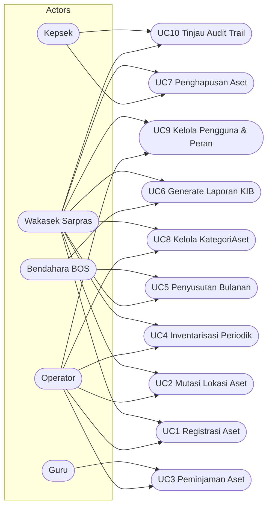

# Use Case & User Stories Sistem Manajemen Aset Sekolah (SIMANIS)

## Pendahuluan
- Lingkup: Mengelola aset sekolah meliputi registrasi, kategorisasi, penempatan/mutasi lokasi, peminjaman, inventarisasi periodik, penyusutan nilai buku, pelaporan KIB, penghapusan, akses pengguna, dan audit trail.
- Keterlacakan: Setiap use case dan user story ditautkan ke entitas dan aturan di `model_domain.md` (lihat referensi baris seperti `model_domain.md:5`, `model_domain.md:31`, `model_domain.md:69`, `model_domain.md:77`).
- Terminologi: Konsisten menggunakan `Aset`, `KategoriAset`, `Lokasi`, `MutasiAset`, `Peminjaman`, `Inventarisasi`, `Penyusutan`, `Pengguna`, `QR code`, `KIB`, `BA` sesuai `model_domain.md`.

## Aktor Utama
- Kepsek: Menyetujui penghapusan aset, meninjau pelaporan KIB, memantau audit trail (`model_domain.md:28–29`).
- Wakasek Sarpras: Mengelola data aset, lokasi, kategori, mutasi, inventarisasi, laporan KIB (`model_domain.md:28–29`).
- Bendahara BOS: Memantau penyusutan dan implikasi nilai buku untuk pelaporan keuangan (`model_domain.md:25–26`, `model_domain.md:55–59`).
- Operator: Melakukan input data aset, peminjaman, inventarisasi, generate QR code dan laporan KIB (`model_domain.md:22–24`, `model_domain.md:69–75`).
- Guru: Mengajukan dan mengembalikan peminjaman aset (`model_domain.md:19–21`, `model_domain.md:47–53`).

## Use Case Diagram (opsional)

## Detail Use Case

### UC1 Registrasi Aset
- Tujuan: Mencatat aset baru dengan metadata lengkap dan menghasilkan QR code.
- Aktor utama: Operator; Aktor sekunder: Wakasek Sarpras.
- Prasyarat: KategoriAset tersedia (`model_domain.md:12–13`).
- Alur dasar:
  - Operator mengisi `kode_aset`, `nama_barang`, `merk`, `spesifikasi`, `tahun_perolehan`, `harga`, `sumber_dana`, `kondisi`, `foto`, `tanggal_pencatatan`, `created_by` (`model_domain.md:33–45`).
  - Sistem mengasosiasikan aset ke `KategoriAset` (`model_domain.md:7`, `model_domain.md:66`).
  - Sistem mengenerate `qr_code` otomatis saat aset dibuat (`model_domain.md:43`, `model_domain.md:72`).
  - Aset berstatus aktif dan siap ditempatkan.
- Alternatif & pengecualian:
  - A1: `kode_aset` duplikat → sistem menolak dan meminta perbaikan (validasi unik `model_domain.md:34`).
  - E1: Kategori tidak ditemukan → Operator membuat kategori baru terlebih dahulu (lihat UC8).
- Kriteria penerimaan:
  - Given data aset lengkap, When disimpan, Then `qr_code` terbentuk dan aset tersimpan dengan referensi kategori (`model_domain.md:34–45`, `model_domain.md:72`).
  - Given duplikasi `kode_aset`, When simpan, Then sistem menolak dengan pesan validasi.

### UC2 Mutasi Lokasi Aset
- Tujuan: Memindahkan aset antar lokasi dengan histori mutasi dan update lokasi terakhir.
- Aktor utama: Wakasek Sarpras; Aktor sekunder: Operator.
- Prasyarat: Lokasi tersedia dengan hierarki Gedung → Lantai → Ruangan (`model_domain.md:15–17`).
- Alur dasar:
  - Sarpras memilih aset dan lokasi tujuan.
  - Sistem membuat entri `MutasiAset` dan menandai mutasi terbaru sebagai lokasi aktif (`model_domain.md:8`, `model_domain.md:74`).
  - Sistem mengupdate hubungan `Lokasi (1) → (n) Aset` sesuai lokasi baru (`model_domain.md:67`).
- Alternatif & pengecualian:
  - A1: Lokasi tujuan tidak valid → sistem menolak dan menampilkan hierarki lokasi.
  - E1: Aset sedang dipinjam → mutasi ditunda hingga pengembalian (lihat UC3).
- Kriteria penerimaan:
  - Given aset dan lokasi tujuan valid, When mutasi dibuat, Then lokasi aktif aset berubah dan histori mutasi bertambah (`model_domain.md:63`, `model_domain.md:67`, `model_domain.md:74`).

### UC3 Peminjaman Aset
- Tujuan: Mengelola siklus peminjaman aset oleh Guru, inklusif serah terima dan pengembalian.
- Aktor utama: Guru; Aktor sekunder: Operator, Wakasek Sarpras.
- Prasyarat: Aset tersedia dan tidak dalam status hilang/rusak berat (`model_domain.md:41`).
- Alur dasar:
  - Guru mengajukan peminjaman dengan `tujuan_pinjam` dan daftar aset.
  - Operator membuat entri `Peminjaman` dengan `tanggal_pinjam`, `peminjam`, `status` awal Dipinjam (`model_domain.md:47–53`).
  - Pada pengembalian, Operator mengisi `tanggal_kembali`, `catatan`, dan memperbarui `status` jadi Dikembalikan.
- Alternatif & pengecualian:
  - A1: Pengembalian terlambat → status menjadi Terlambat.
  - A2: Aset rusak saat pengembalian → status Rusak dan kondisi aset diperbarui (`model_domain.md:41`).
  - E1: Aset tidak tersedia → sistem menolak pengajuan.
- Kriteria penerimaan:
  - Given pengajuan valid, When dibuat, Then record `Peminjaman` tercatat dengan status Dipinjam/Dikembalikan/ Terlambat/ Rusak sesuai peristiwa (`model_domain.md:19–21`, `model_domain.md:47–53`).

### UC4 Inventarisasi Periodik
- Tujuan: Melakukan stock opname berkala menggunakan QR code dan bukti foto.
- Aktor utama: Operator; Aktor sekunder: Wakasek Sarpras.
- Prasyarat: Aset memiliki `qr_code` (`model_domain.md:43`).
- Alur dasar:
  - Operator memindai QR code aset dan mengunggah foto bukti keadaan aset (`model_domain.md:22–24`).
  - Sistem mencatat entri `Inventarisasi` terhubung ke aset (`model_domain.md:64`).
- Alternatif & pengecualian:
  - A1: QR code tidak terbaca → input manual `kode_aset`.
  - E1: Foto gagal diunggah → sistem menyimpan catatan inventarisasi tanpa foto dengan flag incomplete.
- Kriteria penerimaan:
  - Given scan berhasil, When inventarisasi disimpan, Then entri terbuat dan tertaut ke aset (`model_domain.md:22–24`, `model_domain.md:64`).

### UC5 Penyusutan Bulanan (Garis Lurus)
- Tujuan: Menghitung nilai penyusutan dan nilai buku aset setiap akhir bulan secara otomatis.
- Aktor utama: Sistem; Aktor sekunder: Bendahara BOS, Wakasek Sarpras.
- Prasyarat: Aset memiliki `harga` dan `masa_manfaat` terkait kebijakan BMN (`model_domain.md:39`, `model_domain.md:25–26`, `model_domain.md:59`).
- Alur dasar:
  - Scheduler akhir bulan mengeksekusi perhitungan metode garis lurus.
  - Sistem mencatat `nilai_penyusutan`, memperbarui `nilai_buku`, dan `tanggal_hitung` (`model_domain.md:56–58`).
- Alternatif & pengecualian:
  - A1: Aset masa manfaat 0 atau tidak terdefinisi → dilewati dan dilaporkan.
  - E1: Perhitungan gagal → sistem mencatat error log untuk ditinjau.
- Kriteria penerimaan:
  - Given akhir bulan, When scheduler berjalan, Then entri penyusutan tercatat untuk aset eligible (`model_domain.md:71`, `model_domain.md:55–59`).

### UC6 Generate Laporan KIB
- Tujuan: Menghasilkan laporan KIB dalam format Excel/PDF.
- Aktor utama: Wakasek Sarpras; Aktor sekunder: Bendahara BOS.
- Prasyarat: Data aset dan penempatan/mutasi terbaru tersedia (`model_domain.md:63`, `model_domain.md:67`).
- Alur dasar:
  - Sarpras memilih filter laporan (kategori, lokasi, kondisi).
  - Sistem menghasilkan file Excel/PDF sesuai standar KIB (`model_domain.md:73`).
- Alternatif & pengecualian:
  - A1: Tidak ada data sesuai filter → sistem menghasilkan laporan kosong dengan catatan.
- Kriteria penerimaan:
  - Given filter valid, When generate, Then file Excel/PDF dapat diunduh dan berisi data konsisten (`model_domain.md:73`).

### UC7 Penghapusan Aset
- Tujuan: Mengubah status aset menjadi Dihapus dengan unggahan berita acara (BA) sederhana.
- Aktor utama: Wakasek Sarpras; Aktor sekunder: Kepsek.
- Prasyarat: Aset dalam kondisi rusak berat/hilang dan disetujui kebijakan internal (`model_domain.md:41`).
- Alur dasar:
  - Sarpras mengubah status aset menjadi Dihapus dan mengunggah BA (`model_domain.md:75`).
  - Kepsek meninjau dan menyetujui perubahan jika diperlukan.
- Alternatif & pengecualian:
  - A1: BA belum tersedia → perubahan ditunda dengan status menunggu BA.
  - E1: Kepsek menolak → status aset dikembalikan ke sebelumnya.
- Kriteria penerimaan:
  - Given BA diunggah, When status diubah, Then aset berstatus Dihapus dan bukti tersimpan (`model_domain.md:75`).

### UC8 Kelola KategoriAset
- Tujuan: Menambah/melihat/memperbarui daftar KategoriAset dan mengaitkan aset ke kategori.
- Aktor utama: Operator; Aktor sekunder: Wakasek Sarpras.
- Alur dasar:
  - Operator menambah kategori umum yang dibutuhkan (`model_domain.md:12–13`).
  - Operator mengaitkan aset ke kategori yang relevan (`model_domain.md:7`).
- Alternatif & pengecualian:
  - A1: Kategori duplikat → sistem menolak.
- Kriteria penerimaan:
  - Given kategori valid, When disimpan, Then kategori tersedia dan aset dapat dikaitkan (`model_domain.md:7`, `model_domain.md:12–13`).

### UC9 Kelola Pengguna & Peran
- Tujuan: Mengelola pengguna dan role-based access control (RBAC).
- Aktor utama: Wakasek Sarpras; Aktor sekunder: Operator.
- Alur dasar:
  - Sarpras menetapkan peran pada pengguna: Kepsek, Wakasek Sarpras, Bendahara BOS, Operator, Guru (`model_domain.md:28–29`).
  - Sistem menerapkan hak akses sesuai peran.
- Alternatif & pengecualian:
  - A1: Peran tidak sesuai tugas → Sarpras menyesuaikan.
- Kriteria penerimaan:
  - Given peran ditetapkan, When pengguna login, Then akses fitur sesuai peran berlaku (`model_domain.md:28–29`).

### UC10 Tinjau Audit Trail
- Tujuan: Meninjau perubahan data aset untuk akuntabilitas.
- Aktor utama: Kepsek; Aktor sekunder: Wakasek Sarpras.
- Alur dasar:
  - Kepsek memfilter log berdasarkan entitas/aksi/waktu.
  - Sistem menampilkan `user_id`, `action`, `timestamp`, `field_changed` (`model_domain.md:79–83`).
- Alternatif & pengecualian:
  - A1: Tidak ada log sesuai filter → tampilkan kosong.
- Kriteria penerimaan:
  - Given filter diterapkan, When ditampilkan, Then audit trail memuat atribut minimal dan akurat (`model_domain.md:79–83`).

## User Stories per Epic

### Epic: Registrasi & Kategorisasi Aset
- US-REG-1 [Must]: Sebagai Operator, saya ingin mendaftarkan aset baru sehingga data inventaris lengkap.
  - Acceptance: Given data wajib diisi, When simpan, Then aset tersimpan, `qr_code` otomatis, dan terkait ke kategori (`model_domain.md:33–45`, `model_domain.md:72`).
  - Terkait UC: UC1.
- US-REG-2 [Should]: Sebagai Wakasek Sarpras, saya ingin meninjau entri aset sehingga kualitas data terjaga.
  - Acceptance: Given aset baru, When disetujui/ditolak, Then status review tercatat.
  - Terkait UC: UC1.

### Epic: Penempatan & Mutasi Lokasi
- US-MUT-1 [Must]: Sebagai Wakasek Sarpras, saya ingin memutasi aset sehingga lokasi terakhir selalu akurat.
  - Acceptance: Given aset dan lokasi, When mutasi, Then lokasi aktif diperbarui dan histori mutasi bertambah (`model_domain.md:63`, `model_domain.md:67`, `model_domain.md:74`).
  - Terkait UC: UC2.

### Epic: Peminjaman
- US-PJM-1 [Must]: Sebagai Guru, saya ingin mengajukan peminjaman aset sehingga kegiatan bisa berjalan.
  - Acceptance: Given aset tersedia, When ajukan, Then `Peminjaman` berstatus Dipinjam lalu Dikembalikan saat selesai (`model_domain.md:19–21`, `model_domain.md:47–53`).
  - Terkait UC: UC3.
- US-PJM-2 [Should]: Sebagai Operator, saya ingin menandai keterlambatan sehingga kepatuhan terukur.
  - Acceptance: Given lewat jatuh tempo, When pengembalian, Then status Terlambat tercatat (`model_domain.md:19–21`).
  - Terkait UC: UC3.
- US-PJM-3 [Could]: Sebagai Operator, saya ingin mencatat kondisi rusak saat kembali sehingga perawatan terencana.
  - Acceptance: Given aset dikembalikan rusak, When catat, Then status Rusak dan catatan tersimpan (`model_domain.md:19–21`, `model_domain.md:41`).
  - Terkait UC: UC3.

### Epic: Inventarisasi
- US-INV-1 [Must]: Sebagai Operator, saya ingin stock opname via QR sehingga verifikasi lebih cepat.
  - Acceptance: Given QR valid, When scan dan unggah foto, Then entri Inventarisasi terbentuk (`model_domain.md:22–24`, `model_domain.md:64`).
  - Terkait UC: UC4.
- US-INV-2 [Should]: Sebagai Wakasek Sarpras, saya ingin meninjau hasil inventarisasi sehingga anomali terdeteksi.
  - Acceptance: Given entri inventarisasi, When audit, Then daftar dengan status lengkap ditampilkan.
  - Terkait UC: UC4.

### Epic: Penyusutan
- US-PST-1 [Must]: Sebagai Bendahara BOS, saya ingin melihat hasil penyusutan bulanan sehingga nilai buku akurat.
  - Acceptance: Given akhir bulan, When perhitungan otomatis selesai, Then nilai penyusutan dan nilai buku tercatat (`model_domain.md:71`, `model_domain.md:56–59`).
  - Terkait UC: UC5.

### Epic: Pelaporan KIB
- US-KIB-1 [Must]: Sebagai Wakasek Sarpras, saya ingin menghasilkan laporan KIB sehingga pelaporan formal terpenuhi.
  - Acceptance: Given filter dipilih, When generate, Then file Excel/PDF tersedia (`model_domain.md:73`).
  - Terkait UC: UC6.

### Epic: Penghapusan Aset
- US-HPS-1 [Must]: Sebagai Wakasek Sarpras, saya ingin menghapus aset dengan BA sehingga daftar aset bersih.
  - Acceptance: Given BA diunggah, When ubah status, Then aset menjadi Dihapus (`model_domain.md:75`).
  - Terkait UC: UC7.
- US-HPS-2 [Should]: Sebagai Kepsek, saya ingin menyetujui penghapusan sehingga kontrol tetap terjaga.
  - Acceptance: Given pengajuan penghapusan, When setujui/tolak, Then keputusan tercatat.
  - Terkait UC: UC7.

### Epic: Akses & Audit
- US-RBAC-1 [Must]: Sebagai Wakasek Sarpras, saya ingin mengatur peran pengguna sehingga akses sesuai tugas.
  - Acceptance: Given peran ditetapkan, When pengguna mengakses fitur, Then kontrol akses berjalan (`model_domain.md:28–29`).
  - Terkait UC: UC9.
- US-AUD-1 [Should]: Sebagai Kepsek, saya ingin meninjau audit trail sehingga akuntabilitas terjaga.
  - Acceptance: Given filter log, When lihat, Then `user_id`, `action`, `timestamp`, `field_changed` tercantum (`model_domain.md:79–83`).
  - Terkait UC: UC10.

## Matriks Keterkaitan (Use Case ↔ User Stories)
- UC1 → US-REG-1, US-REG-2
- UC2 → US-MUT-1
- UC3 → US-PJM-1, US-PJM-2, US-PJM-3
- UC4 → US-INV-1, US-INV-2
- UC5 → US-PST-1
- UC6 → US-KIB-1
- UC7 → US-HPS-1, US-HPS-2
- UC8 → US-REG-1
- UC9 → US-RBAC-1
- UC10 → US-AUD-1

## Konsistensi & Verifikasi
- Semua entitas dan relasi pada `model_domain.md` tercermin dalam UC dan US: `Aset`, `KategoriAset`, `Lokasi`+`MutasiAset`, `Peminjaman`, `Inventarisasi`, `Penyusutan`, `Pengguna`, laporan `KIB`, audit trail.
- Tidak ada kontradiksi: Aturan bisnis dipatuhi, termasuk penyusutan otomatis akhir bulan (`model_domain.md:71`), QR code otomatis saat aset dibuat (`model_domain.md:72`), mutasi mengupdate lokasi terakhir (`model_domain.md:74`), penghapusan dengan BA (`model_domain.md:75`).